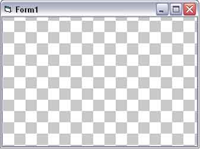

## Photoshop like Grid

### Description

Code that will draw a photoshop like grid on any DC. Any cellsize allowed.
 
### More Info
 

             |
---                |---
**Submitted On**   |2004-11-12 22:28:58
**By**             |[\[D\]Man](https://github.com/Planet-Source-Code/PSCIndex/blob/master/ByAuthor/d-man.md)
**Level**          |Beginner
**User Rating**    |5.0 (15 globes from 3 users)
**Compatibility**  |VB 5\.0, VB 6\.0
**Category**       |[Graphics](https://github.com/Planet-Source-Code/PSCIndex/blob/master/ByCategory/graphics__1-46.md)
**World**          |[Visual Basic](https://github.com/Planet-Source-Code/PSCIndex/blob/master/ByWorld/visual-basic.md)
**Archive File**   |[Photoshop\_18222411272004\.zip](https://github.com/Planet-Source-Code/d-man-photoshop-like-grid__1-57434/archive/master.zip)

